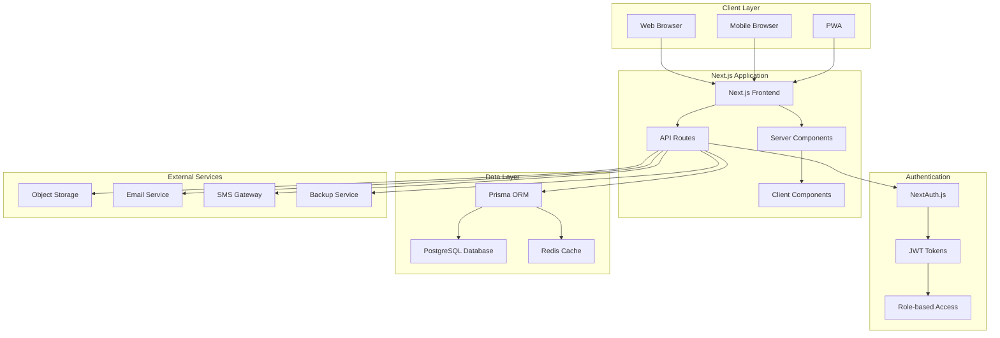

# Design Document: OpenSID Next.js Migration

## Overview

This document outlines the architectural design for migrating OpenSID from its current CodeIgniter 3.1 + Laravel components hybrid architecture to a modern Next.js-based full-stack application. The migration will transform OpenSID into a scalable, maintainable, and performant village information system while preserving all existing functionality.

### Current Architecture Analysis

OpenSID currently operates as a hybrid system:
- **Frontend**: PHP-based views with CodeIgniter 3.1 templating
- **Backend**: CodeIgniter 3.1 controllers with Laravel Eloquent models and services
- **Database**: MySQL with Laravel migrations and seeders
- **Authentication**: Custom PHP session-based authentication
- **File Structure**: Monolithic structure with over 100 controllers and models

### Target Architecture

The new architecture will be a modern full-stack Next.js application:
- **Frontend**: Next.js 14+ with App Router, React Server Components, and TypeScript
- **Backend**: Next.js API routes with tRPC for type-safe APIs
- **Database**: PostgreSQL with Prisma ORM for type safety and better performance
- **Authentication**: NextAuth.js with JWT tokens and role-based access control
- **Styling**: Tailwind CSS with shadcn/ui components
- **State Management**: Zustand for client-side state management
- **File Storage**: AWS S3 or compatible object storage for documents and media

## Architecture

### System Architecture Diagram



### Technology Stack

#### Frontend
- **Framework**: Next.js 14+ with App Router
- **Language**: TypeScript for type safety
- **Styling**: Tailwind CSS with shadcn/ui component library
- **State Management**: Zustand for global state, React Query for server state
- **Forms**: React Hook Form with Zod validation
- **Charts**: Recharts for data visualization
- **Maps**: Leaflet for GIS functionality
- **PWA**: Next-PWA for offline capabilities

#### Backend
- **API**: Next.js API routes with tRPC for type-safe APIs
- **Database**: PostgreSQL with Prisma ORM
- **Authentication**: NextAuth.js with multiple providers
- **File Upload**: Next.js built-in file handling with object storage
- **Background Jobs**: Bull Queue with Redis
- **Caching**: Redis for session and data caching
- **Email**: Nodemailer with SMTP support
- **PDF Generation**: Puppeteer for report generation

#### Infrastructure
- **Database**: PostgreSQL 15+
- **Cache**: Redis 7+
- **Object Storage**: AWS S3 or MinIO
- **Deployment**: Docker containers with Docker Compose
- **Monitoring**: Built-in Next.js analytics and logging

## Components and Interfaces

### Core Modules

#### 1. Authentication & Authorization Module
```typescript
interface AuthModule {
  // User authentication
  login(credentials: LoginCredentials): Promise<AuthResult>
  logout(): Promise<void>
  register(userData: RegisterData): Promise<User>
  
  // Role-based access control
  checkPermission(user: User, resource: string, action: string): boolean
  getUserRoles(userId: string): Promise<Role[]>
  
  // Session management
  refreshToken(token: string): Promise<string>
  validateSession(sessionId: string): Promise<boolean>
}
```

#### 2. Citizen Management Module
```typescript
interface CitizenModule {
  // CRUD operations
  createCitizen(data: CitizenData): Promise<Citizen>
  updateCitizen(id: string, data: Partial<CitizenData>): Promise<Citizen>
  deleteCitizen(id: string): Promise<void>
  getCitizen(id: string): Promise<Citizen>
  
  // Family management
  createFamily(data: FamilyData): Promise<Family>
  addFamilyMember(familyId: string, citizenId: string): Promise<void>
  
  // Document management
  uploadDocument(citizenId: string, document: DocumentData): Promise<Document>
  generateCertificate(citizenId: string, type: CertificateType): Promise<Certificate>
}
```

#### 3. Administrative Services Module
```typescript
interface AdminServicesModule {
  // Letter/Document services
  createLetterRequest(data: LetterRequestData): Promise<LetterRequest>
  processLetterRequest(requestId: string, action: ProcessAction): Promise<void>
  generateLetter(requestId: string): Promise<GeneratedLetter>
  
  // Village administration
  manageVillageData(data: VillageData): Promise<Village>
  generateReports(type: ReportType, filters: ReportFilters): Promise<Report>
  
  // Inventory management
  manageInventory(data: InventoryData): Promise<InventoryItem>
  trackAssets(filters: AssetFilters): Promise<Asset[]>
}
```

#### 4. Financial Management Module
```typescript
interface FinancialModule {
  // Budget management
  createBudget(data: BudgetData): Promise<Budget>
  trackExpenses(data: ExpenseData): Promise<Expense>
  generateFinancialReport(period: DateRange): Promise<FinancialReport>
  
  // Aid/Assistance programs
  manageBeneficiaries(programId: string, data: BeneficiaryData): Promise<Beneficiary>
  trackAidDistribution(data: DistributionData): Promise<Distribution>
}
```

#### 5. Web Portal Module
```typescript
interface WebPortalModule {
  // Content management
  manageArticles(data: ArticleData): Promise<Article>
  manageGallery(data: GalleryData): Promise<GalleryItem>
  manageAnnouncements(data: AnnouncementData): Promise<Announcement>
  
  // Public services
  submitComplaint(data: ComplaintData): Promise<Complaint>
  trackComplaintStatus(complaintId: string): Promise<ComplaintStatus>
  
  // Information display
  getPublicInformation(type: InfoType): Promise<PublicInfo>
  getVillageStatistics(): Promise<VillageStats>
}
```

### API Design

#### RESTful API Structure
```
/api/v1/
├── auth/
│   ├── login
│   ├── logout
│   ├── refresh
│   └── profile
├── citizens/
│   ├── [id]
│   ├── families/[familyId]
│   ├── documents/
│   └── certificates/
├── admin/
│   ├── letters/
│   ├── reports/
│   ├── inventory/
│   └── settings/
├── financial/
│   ├── budgets/
│   ├── expenses/
│   ├── aid-programs/
│   └── reports/
└── public/
    ├── articles/
    ├── announcements/
    ├── complaints/
    └── statistics/
```

#### tRPC Router Structure
```typescript
export const appRouter = router({
  auth: authRouter,
  citizens: citizensRouter,
  admin: adminRouter,
  financial: financialRouter,
  public: publicRouter,
});
```

## Data Models

### Core Entities

#### User & Authentication
```typescript
interface User {
  id: string
  username: string
  email: string
  name: string
  role: UserRole
  permissions: Permission[]
  isActive: boolean
  lastLogin: Date
  createdAt: Date
  updatedAt: Date
}

interface UserRole {
  id: string
  name: string
  description: string
  permissions: Permission[]
}
```

#### Citizen & Family
```typescript
interface Citizen {
  id: string
  nik: string // National ID Number
  name: string
  birthDate: Date
  birthPlace: string
  gender: Gender
  religion: Religion
  education: Education
  occupation: Occupation
  maritalStatus: MaritalStatus
  familyId?: string
  address: Address
  documents: Document[]
  createdAt: Date
  updatedAt: Date
}

interface Family {
  id: string
  familyNumber: string
  headOfFamily: Citizen
  members: Citizen[]
  address: Address
  socialStatus: SocialStatus
  createdAt: Date
  updatedAt: Date
}
```

#### Administrative Documents
```typescript
interface LetterRequest {
  id: string
  citizenId: string
  letterType: LetterType
  purpose: string
  status: RequestStatus
  requestedAt: Date
  processedAt?: Date
  processedBy?: string
  documents: Document[]
  notes?: string
}

interface Certificate {
  id: string
  citizenId: string
  type: CertificateType
  number: string
  issuedAt: Date
  issuedBy: string
  validUntil?: Date
  content: string
}
```

### Database Schema Design

#### Migration Strategy
1. **Phase 1**: Create new PostgreSQL schema alongside existing MySQL
2. **Phase 2**: Implement data migration scripts with validation
3. **Phase 3**: Run parallel systems during transition period
4. **Phase 4**: Switch to new system and archive old data

#### Prisma Schema Structure
```prisma
model User {
  id        String   @id @default(cuid())
  username  String   @unique
  email     String   @unique
  name      String
  roleId    String
  role      UserRole @relation(fields: [roleId], references: [id])
  isActive  Boolean  @default(true)
  createdAt DateTime @default(now())
  updatedAt DateTime @updatedAt
  
  @@map("users")
}

model Citizen {
  id          String    @id @default(cuid())
  nik         String    @unique
  name        String
  birthDate   DateTime
  birthPlace  String
  gender      Gender
  religion    Religion
  familyId    String?
  family      Family?   @relation(fields: [familyId], references: [id])
  documents   Document[]
  createdAt   DateTime  @default(now())
  updatedAt   DateTime  @updatedAt
  
  @@map("citizens")
}
```

## Error Handling

### Error Types and Handling Strategy

#### Client-Side Error Handling
```typescript
// Global error boundary for React components
class GlobalErrorBoundary extends Component {
  handleError(error: Error, errorInfo: ErrorInfo) {
    // Log error to monitoring service
    // Show user-friendly error message
    // Provide recovery options
  }
}

// API error handling with React Query
const useApiCall = () => {
  return useQuery({
    queryKey: ['data'],
    queryFn: fetchData,
    onError: (error) => {
      // Handle different error types
      if (error.status === 401) {
        // Redirect to login
      } else if (error.status === 403) {
        // Show permission denied message
      } else {
        // Show generic error message
      }
    }
  })
}
```

#### Server-Side Error Handling
```typescript
// Global error handler for API routes
export function globalErrorHandler(error: Error, req: NextRequest) {
  // Log error with context
  logger.error('API Error', {
    error: error.message,
    stack: error.stack,
    url: req.url,
    method: req.method,
    timestamp: new Date().toISOString()
  })
  
  // Return appropriate error response
  if (error instanceof ValidationError) {
    return NextResponse.json({ error: 'Validation failed' }, { status: 400 })
  } else if (error instanceof AuthenticationError) {
    return NextResponse.json({ error: 'Authentication required' }, { status: 401 })
  } else {
    return NextResponse.json({ error: 'Internal server error' }, { status: 500 })
  }
}
```

### Error Recovery Mechanisms
- **Automatic retry** for transient failures
- **Graceful degradation** for non-critical features
- **Offline support** with service workers
- **Data synchronization** when connection is restored

## Testing Strategy

### Testing Pyramid

#### Unit Tests (70%)
- **Components**: React Testing Library for UI components
- **Utilities**: Jest for business logic and utility functions
- **API Routes**: Supertest for API endpoint testing
- **Database**: In-memory database for model testing

#### Integration Tests (20%)
- **API Integration**: Test complete API workflows
- **Database Integration**: Test data persistence and relationships
- **Authentication Flow**: Test login/logout and permission systems
- **File Upload**: Test document and media handling

#### End-to-End Tests (10%)
- **Playwright**: Critical user journeys
- **User Workflows**: Complete business processes
- **Cross-browser Testing**: Ensure compatibility
- **Performance Testing**: Load and stress testing

### Testing Tools and Configuration
```typescript
// Jest configuration for unit tests
export default {
  testEnvironment: 'jsdom',
  setupFilesAfterEnv: ['<rootDir>/jest.setup.js'],
  moduleNameMapping: {
    '^@/(.*)$': '<rootDir>/src/$1',
  },
  collectCoverageFrom: [
    'src/**/*.{js,jsx,ts,tsx}',
    '!src/**/*.d.ts',
  ],
  coverageThreshold: {
    global: {
      branches: 80,
      functions: 80,
      lines: 80,
      statements: 80,
    },
  },
}

// Playwright configuration for E2E tests
export default {
  testDir: './e2e',
  fullyParallel: true,
  forbidOnly: !!process.env.CI,
  retries: process.env.CI ? 2 : 0,
  workers: process.env.CI ? 1 : undefined,
  reporter: 'html',
  use: {
    baseURL: 'http://localhost:3000',
    trace: 'on-first-retry',
  },
  projects: [
    {
      name: 'chromium',
      use: { ...devices['Desktop Chrome'] },
    },
    {
      name: 'firefox',
      use: { ...devices['Desktop Firefox'] },
    },
    {
      name: 'webkit',
      use: { ...devices['Desktop Safari'] },
    },
  ],
}
```

## Performance Optimization

### Frontend Performance
- **Server-Side Rendering**: Next.js App Router for initial page loads
- **Static Generation**: Pre-generate static pages where possible
- **Code Splitting**: Automatic code splitting with Next.js
- **Image Optimization**: Next.js Image component with WebP support
- **Bundle Analysis**: Regular bundle size monitoring
- **Lazy Loading**: Lazy load non-critical components and routes

### Backend Performance
- **Database Optimization**: Proper indexing and query optimization
- **Caching Strategy**: Redis for session and frequently accessed data
- **Connection Pooling**: Prisma connection pooling for database
- **Background Jobs**: Queue system for heavy operations
- **API Response Caching**: Cache static API responses

### Monitoring and Analytics
```typescript
// Performance monitoring setup
import { Analytics } from '@vercel/analytics/react'
import { SpeedInsights } from '@vercel/speed-insights/next'

export default function RootLayout({ children }) {
  return (
    <html>
      <body>
        {children}
        <Analytics />
        <SpeedInsights />
      </body>
    </html>
  )
}
```

## Security Considerations

### Authentication & Authorization
- **Multi-factor Authentication**: Optional 2FA for admin users
- **Role-based Access Control**: Granular permissions system
- **Session Management**: Secure JWT token handling
- **Password Security**: Bcrypt hashing with salt rounds

### Data Protection
- **Input Validation**: Zod schemas for all user inputs
- **SQL Injection Prevention**: Prisma ORM parameterized queries
- **XSS Protection**: Content Security Policy headers
- **CSRF Protection**: Built-in Next.js CSRF protection

### Infrastructure Security
- **HTTPS Enforcement**: SSL/TLS for all communications
- **Environment Variables**: Secure configuration management
- **Rate Limiting**: API rate limiting to prevent abuse
- **Audit Logging**: Comprehensive activity logging

### Compliance
- **Data Privacy**: GDPR-compliant data handling
- **Data Retention**: Configurable data retention policies
- **Backup Security**: Encrypted backups with access controls
- **Incident Response**: Security incident response procedures

## Deployment Architecture

### Container Strategy
```dockerfile
# Multi-stage Docker build
FROM node:18-alpine AS base
WORKDIR /app
COPY package*.json ./
RUN npm ci --only=production

FROM base AS build
COPY . .
RUN npm run build

FROM base AS runtime
COPY --from=build /app/.next ./.next
COPY --from=build /app/public ./public
EXPOSE 3000
CMD ["npm", "start"]
```

### Infrastructure as Code
```yaml
# docker-compose.yml for development
version: '3.8'
services:
  app:
    build: .
    ports:
      - "3000:3000"
    environment:
      - DATABASE_URL=postgresql://user:pass@db:5432/opensid
      - REDIS_URL=redis://redis:6379
    depends_on:
      - db
      - redis
  
  db:
    image: postgres:15
    environment:
      - POSTGRES_DB=opensid
      - POSTGRES_USER=user
      - POSTGRES_PASSWORD=pass
    volumes:
      - postgres_data:/var/lib/postgresql/data
  
  redis:
    image: redis:7-alpine
    volumes:
      - redis_data:/data

volumes:
  postgres_data:
  redis_data:
```

### Production Deployment
- **Load Balancing**: Multiple application instances behind load balancer
- **Database Clustering**: PostgreSQL primary-replica setup
- **CDN Integration**: Static asset delivery via CDN
- **Monitoring**: Application and infrastructure monitoring
- **Backup Strategy**: Automated daily backups with retention policy

This design provides a comprehensive blueprint for migrating OpenSID to a modern, scalable Next.js architecture while maintaining all existing functionality and improving performance, security, and maintainability.